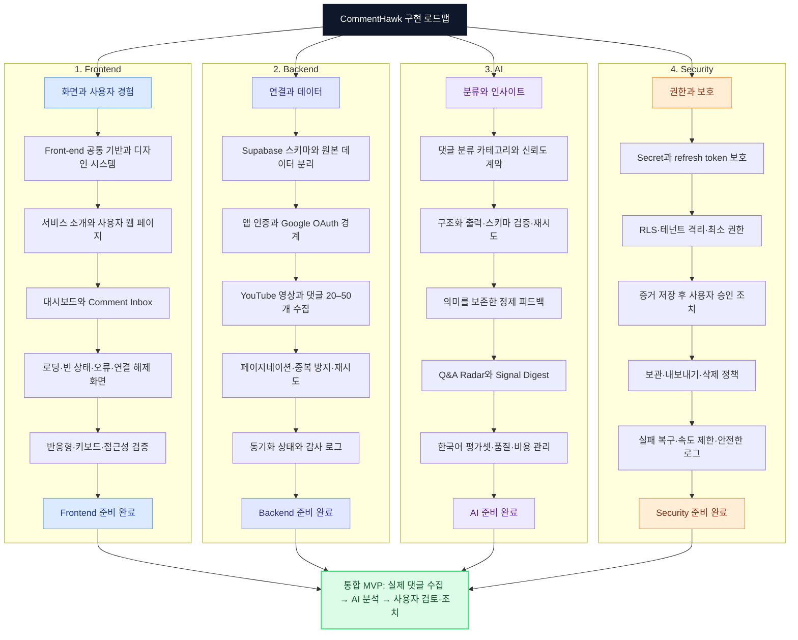

# CommentHawk 개발 로드맵

이 문서는 CommentHawk를 구현하기 위한 큰 개발 흐름을 보여줍니다. 각 노드는 계획이며 현재 완료 상태를 의미하지 않습니다.

## 수정 방법

1. 이 파일의 Mermaid 코드에서 노드나 연결선을 수정합니다.
2. 변경 내용을 Git 커밋으로 남깁니다.
3. 팀 작업에서는 Pull Request로 검토한 뒤 병합합니다.

실제 작업 상태와 담당자 관리는 추후 GitHub Issues 또는 GitHub Projects를 단일 원본으로 사용합니다.
