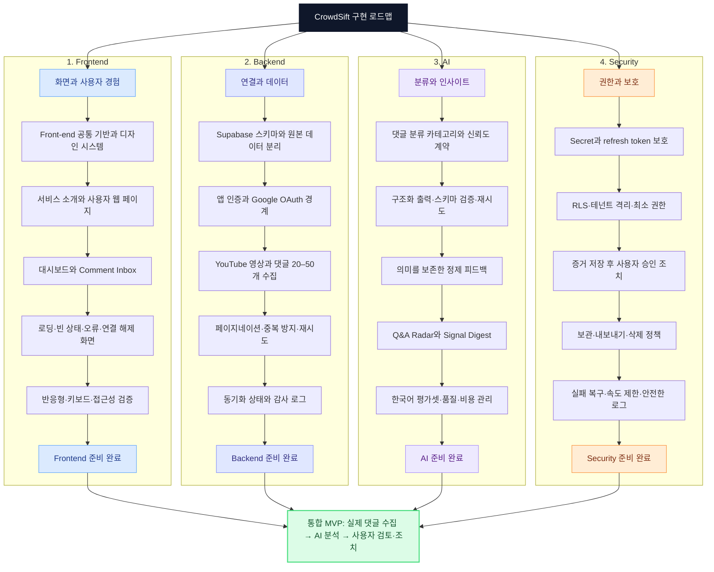

# GitHub Mermaid Roadmap Implementation Plan

> **For agentic workers:** REQUIRED SUB-SKILL: Use superpowers:subagent-driven-development (recommended) or superpowers:executing-plans to implement this plan task-by-task. Steps use checkbox (`- [ ]`) syntax for tracking.

**Goal:** Replace the customer-facing interactive development map with one GitHub-rendered Mermaid roadmap document.

**Architecture:** The Next.js `/` route becomes customer-only again. `docs/development-roadmap.md` becomes the single roadmap source, rendered by GitHub from a fenced Mermaid block and changed through commits or pull requests. The React Mermaid renderer, localStorage editor, and production `mermaid` dependency are removed completely.

**Tech Stack:** Markdown, Mermaid syntax rendered by GitHub, Next.js 16.2.11, React 19.2.4, Vitest 4.1.10, Testing Library 16.3.2

## Global Constraints

- Keep `src/app/page.tsx` customer-facing only; do not link the roadmap from customer navigation.
- Use `docs/development-roadmap.md` as the only editable roadmap source.
- Preserve the four fixed lanes: Frontend, Backend, AI, and Security.
- Preserve the existing ordered tasks and the integrated MVP convergence goal.
- Remove all browser editing, localStorage persistence, full-screen, copy, and runtime Mermaid rendering code.
- Keep Vitest and Testing Library because the landing-page regression test remains useful.
- Do not modify or commit the unrelated `docs/codex-guides/` directory or `docs/superpowers/specs/2026-07-22-codex-guides-rewrite-design.md` change.

---

### Task 1: Create the GitHub-rendered roadmap source

**Files:**
- Create: `docs/development-roadmap.md`
- Modify: `README.md`

**Interfaces:**
- Consumes: The approved four lanes and task ordering from `src/components/development-map/development-data.ts` before that file is removed.
- Produces: A repository-facing `docs/development-roadmap.md` link from `README.md`.

- [ ] **Step 1: Create the roadmap Markdown document**

Create `docs/development-roadmap.md` with this content:

````markdown
# CrowdSift 개발 로드맵

이 문서는 CrowdSift를 구현하기 위한 큰 개발 흐름을 보여줍니다. 각 노드는 계획이며 현재 완료 상태를 의미하지 않습니다.



## 수정 방법

1. 이 파일의 Mermaid 코드에서 노드나 연결선을 수정합니다.
2. 변경 내용을 Git 커밋으로 남깁니다.
3. 팀 작업에서는 Pull Request로 검토한 뒤 병합합니다.

실제 작업 상태와 담당자 관리는 추후 GitHub Issues 또는 GitHub Projects를 단일 원본으로 사용합니다.
````

- [ ] **Step 2: Update the README**

Change the repository-state paragraph to:

```markdown
현재 저장소는 첫 번째 Next.js 고객 화면까지 구성된 초기 단계입니다. YouTube OAuth, 댓글 수집, Supabase, AI 분류는 아직 연결되어 있지 않습니다.
```

Delete the complete `## CrowdSift 개발 지도` section and its four bullets. Add this item under `## 프로젝트 문서`:

```markdown
- [개발 로드맵](docs/development-roadmap.md)
```

- [ ] **Step 3: Verify the document structure**

Run:

```bash
rg -n '^```mermaid$|Frontend|Backend|AI|Security|통합 MVP|수정 방법' docs/development-roadmap.md
```

Expected: one Mermaid fence, all four lane names, the integrated MVP label, and the editing section are present.

- [ ] **Step 4: Commit the documentation source**

```bash
git add docs/development-roadmap.md README.md
git commit -m "docs: move development roadmap to Mermaid Markdown"
```

---

### Task 2: Restore the customer-only landing page

**Files:**
- Modify: `src/app/page.test.tsx`
- Modify: `src/app/page.tsx`

**Interfaces:**
- Consumes: The existing `Home` default export from `src/app/page.tsx`.
- Produces: A `/` route with no dependency on `DevelopmentMap` and a regression test that protects that boundary.

- [ ] **Step 1: Write the failing customer-boundary test**

Replace `src/app/page.test.tsx` with:

```tsx
import { render, screen } from "@testing-library/react";
import { describe, expect, it } from "vitest";

import Home from "./page";

describe("Home", () => {
  it("renders only the customer landing content", () => {
    render(<Home />);

    expect(
      screen.getByRole("heading", {
        name: "중요한 댓글은 놓치지 않고, 악성 댓글에는 끌려가지 않도록.",
      }),
    ).toBeInTheDocument();
    expect(
      screen.getByRole("button", { name: "YouTube 연결하기" }),
    ).toBeDisabled();
    expect(
      screen.queryByRole("region", { name: "CrowdSift 개발 지도" }),
    ).not.toBeInTheDocument();
    expect(
      screen.queryByRole("heading", {
        name: "우리가 해야 할 일을, 하나의 지도로 봅니다.",
      }),
    ).not.toBeInTheDocument();
  });
});
```

- [ ] **Step 2: Run the focused test to verify it fails**

Run:

```bash
npm test -- page.test.tsx
```

Expected: FAIL because `CrowdSift 개발 지도` is still rendered.

- [ ] **Step 3: Remove the development map from the page**

Delete this import from `src/app/page.tsx`:

```tsx
import { DevelopmentMap } from "@/components/development-map/development-map";
```

Delete this JSX from `Home`:

```tsx
<DevelopmentMap />
```

- [ ] **Step 4: Run the focused test to verify it passes**

Run:

```bash
npm test -- page.test.tsx
```

Expected: 1 test passes.

- [ ] **Step 5: Commit the customer boundary**

```bash
git add src/app/page.tsx src/app/page.test.tsx
git commit -m "fix: keep development roadmap off customer page"
```

---

### Task 3: Remove the unused web roadmap runtime

**Files:**
- Delete: `src/components/development-map/build-mermaid-source.test.ts`
- Delete: `src/components/development-map/build-mermaid-source.ts`
- Delete: `src/components/development-map/development-data.ts`
- Delete: `src/components/development-map/development-map.test.tsx`
- Delete: `src/components/development-map/development-map.tsx`
- Delete: `src/components/development-map/development-storage.test.ts`
- Delete: `src/components/development-map/development-storage.ts`
- Delete: `src/components/development-map/mermaid-canvas.test.tsx`
- Delete: `src/components/development-map/mermaid-canvas.tsx`
- Delete: `src/components/development-map/plan-editor.test.tsx`
- Delete: `src/components/development-map/plan-editor.tsx`
- Modify: `src/app/globals.css`
- Modify: `package.json`
- Modify: `package-lock.json`

**Interfaces:**
- Consumes: The customer-only page from Task 2, which no longer imports the deleted code.
- Produces: A smaller runtime dependency graph with no browser Mermaid renderer or roadmap source duplication.

- [ ] **Step 1: Delete the unused development-map files with `apply_patch`**

Use an `apply_patch` delete operation for every file listed above under `src/components/development-map/`. Do not delete the directory with `rm`.

- [ ] **Step 2: Remove map-only global CSS**

Delete these blocks from `src/app/globals.css`:

```css
::backdrop {
  background: rgb(15 23 42 / 70%);
}

:fullscreen {
  background: #f8fafc;
}
```

Keep the reduced-motion media query as a general accessibility safeguard.

- [ ] **Step 3: Remove the runtime dependency**

Run:

```bash
npm uninstall mermaid
```

Expected: `mermaid` is removed from `dependencies` and the lockfile is updated without removing Next.js, React, Vitest, or Testing Library.

- [ ] **Step 4: Verify no application references remain**

Run:

```bash
rg -n 'development-map|DevelopmentMap|from "mermaid"|"mermaid"\s*:' src package.json
```

Expected: no output and exit code 1 because no matches remain.

- [ ] **Step 5: Run the full verification suite**

Run:

```bash
npm test
npm run lint
npm run build
```

Expected: all remaining tests pass, ESLint exits with code 0, and Next.js generates the static `/` route successfully.

- [ ] **Step 6: Review scope and commit the cleanup**

Run:

```bash
git diff --check
git status --short
```

Expected: only the listed roadmap cleanup files are changed; `docs/codex-guides/` and `docs/superpowers/specs/2026-07-22-codex-guides-rewrite-design.md` remain untouched.

Commit:

```bash
git add src/components/development-map src/app/globals.css package.json package-lock.json
git commit -m "chore: remove interactive roadmap runtime"
```
